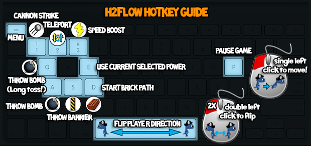
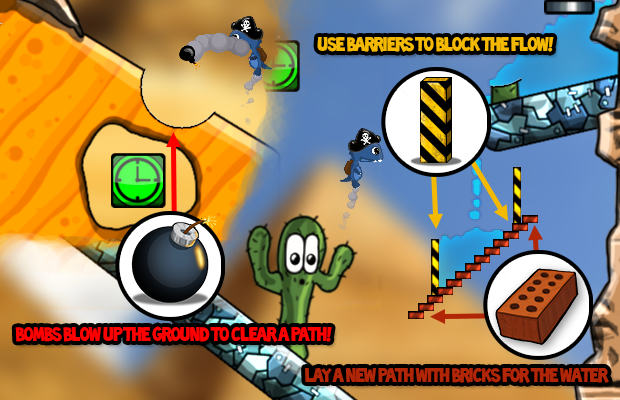
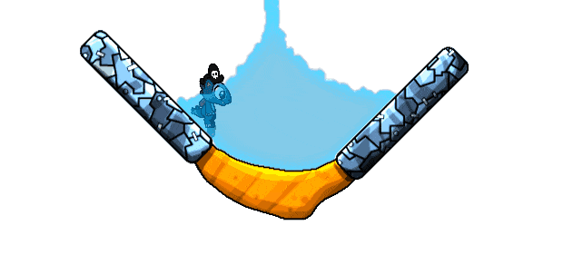

# H2FLOW

[Windows](https://github.com/MRIIOT/h2flow-release/releases/tag/h2flow-win) | [Mac](https://github.com/MRIIOT/h2flow-release/releases/tag/h2flow-mac) | [Linux](https://github.com/MRIIOT/h2flow-release/releases/tag/h2flow-linux)  

Original Release: May 6, 2014


[Trailer Video](https://www.youtube.com/watch?v=eMKIeQu3Jrs)

[Metacritic](https://www.metacritic.com/game/ios/h2flow)

[Failed Kickstarter](https://www.kickstarter.com/projects/haptixgames/h2flow/)

## Description

Get WET this summer with the newest water physics puzzler!

Blast your way through EARTH, ICE, and STEEL as you explore over 50+ exciting levels.  

Alter water streams using BOMBS, BRICKS, and BARRIERS to save every drop!

Think fast! Solve challenging puzzles in unique and interesting ways.

Unlock achievements, awesome power-ups, and cool costumes to help you save the day!

Go with the H2FLOW!

## Keyboard Controls



```
SPACE - turn around
P - pause
A - bomb
Q - bomb high
S - barrier
D - bricks
E - special item
1 - cannon
2 - teleport
3 - speed
```



## Water Artificial Intelligence

Water particle interactions simulated using state-of-the-art deep learning neural networks, powered by reverse osmotic forward rendering texture filters.  

  
  


